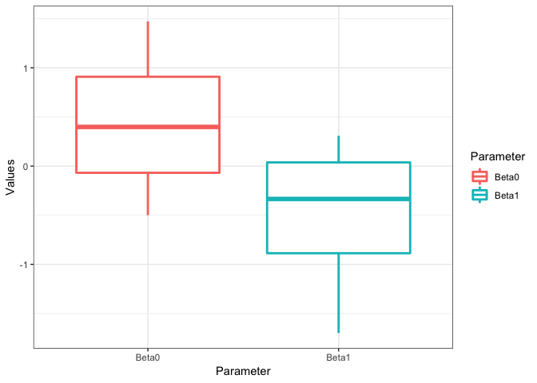

<!-- README.md is generated from README.Rmd. Please edit that file -->

# tidysim

<!-- badges: start -->

[](https://travis-ci.org/coatless/tidysim)
[](https://cran.r-project.org/package=tidysim)
<!-- badges: end -->

The goal of `tidysim` is to provide tools for manipulating simulation
data into a tidy format.

## Installation

You can install the development version from
[GitHub](https://github.com/) with:

``` r
# install.packages("devtools")
devtools::install_github("coatless/tidysim")
```

## Examples

The common task when running simulation studies is to estimate
parameters underneath a specific method and then compare the results.
Estimated parameter data is stored in a `matrix` with each simulation
iteration taking a column and each variable estimation taking a row or
vice versa.

``` r
# Set Seed
set.seed(5812)
# Generate data
my_sim = matrix(rnorm(8), nrow = 2, ncol = 4)

# Apply labels
rownames(my_sim) = c("Beta0", "Beta1")
colnames(my_sim) = paste0("Sim", seq_len(ncol(my_sim)) )

# Example data
my_sim
#>             Sim1       Sim2        Sim3       Sim4
#> Beta0 0.07549022  0.7212808  0.30891740 -1.6976748
#> Beta1 1.47184659 -0.4986810 -0.05306452 -0.6158146
```

Data stored in this manner is problematic as it isn’t easily graphable
under a tidy approach.

Within `tidysim`, the simulation matrix is converted into a tidy
`data.frame`. The `Round` variable indicates the simulation number and
the `Parameter` variable stores the parameter being estimated. Once the
data is generated, it can be coerced into the appropiate shape with
`sim_df(..., wide)`, where `wide` denotes whether to treat the
simulation data as having repeated estimates for parameter estimates
given in the columns or stored row-wise.

``` r
# Load package
library("tidysim")

# Organize by row
my_sim_from_wide = sim_df(my_sim, wide = TRUE)

# View first 5 rows
head(my_sim_from_wide, n = 5)
#>   Round Parameter      Values
#> 1  Sim1     Beta0  0.07549022
#> 2  Sim2     Beta0  1.47184659
#> 3  Sim3     Beta0  0.72128076
#> 4  Sim4     Beta0 -0.49868100
#> 5  Sim1     Beta1  0.30891740

autoplot(my_sim_from_wide)
```



## Authors

James Joseph Balamuta and David Dalpiaz

## License

GPL (\>= 2)
